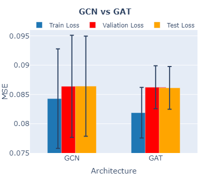

# Introduction

Weather forecasting has traditionally relied on numerical weather prediction (NWP) systems, which integrate physical laws to simulate atmospheric conditions. Despite advancements in data
assimilation, model physics, and supercomputing enhancing forecast accuracy, NWP’s high computational cost remains a limitation. Graph machine learning (GML) offers a transformative approach to weather forecasting, providing accurate forecasts at lower computational costs compared to traditional NWP systems. This shift from deterministic, physics-based modelling to data-driven inference represents a significant paradigm change in meteorology. Advanced architectures like convolutional neural networks (CNNs), transformers, and graph neural networks (GNNs) have significantly improved forecast accuracy, exemplified by models like PanguWeather. These models leverage high-quality reanalysis datasets like ERA5 for training and validation. GraphCast is an advanced ML method for medium-range global weather forecasting, enhancing severe weather predictions by efficiently handling vast reanalysis data. Building on its success, we explore the impact of attention mechanisms and product graphs on weather prediction accuracy and scalability. We introduce GraphCast Lite (GCL) to investigate how these factors affect GNN-based weather prediction models’ accuracy, robustness, and scalability. Using the ERA5 dataset, we compare baseline models with attention-enhanced and SparseGAT models utilizing edge pruning. Our research addresses the following questions:

1. How does the incorporation of attention mechanism affect the accuracy and robustness of
weather predictions using Graph Neural Networks (GNNs)?
2. What is the effect of handling the temporal structure of weather data using product graphs?
3. How can we scale the attention mechanism to handle larger graphs efficiently?

# Dataset

We utilize the ERA5 archive, the fifth-generation ECMWF reanalysis of global weather and climate, which assimilates global weather measurements from 1940. We use a subset from WeatherBench, downsampled to 13 levels every 6h, and apply a 5.625º latitude/longitude resolution. We focus on the bottom 5 atmospheric levels and a 5-year window from 2005 to 2010, selecting 33 features with no NaN values. Non-overlapping rolling windows ensure train-test separation, supporting an observation window up to observation window (O) = 5 and a prediction window (P) = 1. Data is split 80-10-10 for train-validation-test and all features are normalized.

# Methods

Our approach leverages the spatio-temporal structure of weather data,
where each node represents a geographical location with a time series of
weather conditions. We aim to perform node-level regression: given past
weather states over $O+1$ observation windows
$[X_{t-O}, \ldots, X_{t}]$, we predict the next state
$\hat{X}_{t+1} \in \mathbb{R}^{F}$, represented by weather feature
vectors with $F$ features per node.

## Graph Formulation & Model Architecture

Similar to GraphCast, we operate on two levels: the grid
($G$), representing the spatial index of the globe, and the triangular
mesh ($M$), an abstraction aggregating information from multiple grid
nodes and being uniformly dense. Our weather forecasting model uses
three graphs: the grid-to-mesh graph ($G_{G2M}$), the mesh graph
($G_{M}$), and the mesh-to-grid graph ($G_{M2G}$). We construct edges
similarly to GraphCast. The edge set $E_{G2M}$
connects grid nodes to mesh nodes using an $\epsilon$-ball neighborhood,
where $\epsilon$ is a scaled version of the longest edge in the mesh.
The edge set $E_{M}$ connects mesh nodes based on multi-mesh
resolutions, and $\mathcal{E}_{M2G}$ connects mesh nodes at each vertex
of the triangular mesh faces to the grid node contained within the face.

We follow an **encode-process-decode architecture**. The encoder
aggregates grid node features over the past $O$ observation windows into
mesh nodes using the $G_{G2M}$ graph. The processor performs message
passing on the $G_{M}$ graph to capture regional dependencies. The
decoder maps processed mesh nodes back to grid nodes using the $G_{M2G}$
graph, predicting the weather at $t + 1$.

To evaluate attention and product graphs, we define a baseline in the table below. **MLP**s have PReLU activations and layer normalization. **GCNConv** performs one-hop message passing with PReLU activations and layer normalization.

| Model                | Architecture                                                                                                                                                                              |
| -------------------- | ----------------------------------------------------------------------------------------------------------------------------------------------------------------------------------------- |
| **Baseline**         | Encoder: MLP [48, 48, 64] + GCNConv [64, 64, 64], Processor: GCNConv [64, 64, 64], Decoder: MLP [64, 64, 64] + GCNConv [48, 48, 33]                                                       |
| **Attention**        | Encoder: MLP [48, 48, 64] + GCNConv [64, 64, 64], Processor: GATConv [64, 64, 64], Decoder: MLP [64, 64, 64] + GCNConv [48, 48, 33]                                                       |
| **Product Graph**    | Product Graph: GCNConv (Hidden Dim: 33, \#Layers: 5), Encoder: MLP [48, 48, 64] + GCNConv [64, 64, 64], Processor: GCNConv [64, 64, 64], Decoder: MLP [64, 64, 64] + GCNConv [48, 48, 33] |
| **Sparse Attention** | Encoder: MLP [48, 48, 64] + GCNConv [64, 64, 64], Processor: SparseGatConv [64, 64, 64], Decoder: MLP [64, 64, 64] + GCNConv [48, 48, 33]                                                 |

## Attention

Existing work has not explored attention as proposed in Graph Attention
Networks (GATs). We use GAT convolutions to
weigh the importance of neighboring nodes $N_i$ of node $v_i$,
expecting improved performance. We hypothesize that wind
direction will influence attention scores; e.g., with wind components
(u=10, v=0), north-south edges will have lower weights than west-east.
In a multi-mesh, attention scores could also weigh the importance of
local and global edges in $E_{M}$.

## Product graphs

In GraphCast, the authors concatenate features across the
observation window to create grid node features. Instead, we investigate
using product graphs to incorporate temporal information from multiple
time steps. We apply GCNConv layers for message passing on the product
graph, using $O$ as the number of layers. This method progressively
integrates and propagates information from earlier to the most recent
time step, capturing temporal dependencies. Message passing on the
spatio-temporal product graph serves as a pre-encoding step, with the
temporally aware grid node features from the last time step used as
input to the encoder.

## SparseGAT

We introduce SparseGAT, an attention-based edge pruning mechanism that
enhances scalability and explainability in graph machine learning. While attention generally slows down training, SparseGAT
prunes less important edges, making training on large graphs more
scalable, interpretable, and effective. The attention mechanism, with a
head for each feature, allows for feature importance interpretation and
enhances node-node interpretability. SparseGAT's edge
pruning acts as a hard mask, highlighting the most important edges, and
existing methods have maintained accuracy while pruning over 50% of
edges, increasing interpretability. By pruning $K$
edges, training time per epoch is sped up by
$\frac{|E_{M}|}{|E_{M}| - K}$. SparseGAT sets a
threshold for edge attention scores in $E_{M}$ that rises
throughout epochs until reaching a ceiling value. The final threshold is
set to $T = \frac{1+\epsilon}{|\mathcal{N}_i^M|}$ for each mesh node
$v_i^M \in \mathcal{V}_M$, removing edges contributing under average.

# Results

## Experimental Setup

All our experiments have been compared to the baselines described in the table above. For the experiments, only a limited
focus has been laid on hyperparameter tuning. For most of our experiments, the hyperparameters as shown in the table below have been used unless otherwise
specified. The loss function used is Mean Square Error (MSE). We use Adam as our optimizer and add early stopping to prevent overfitting
during training.

| **Batch size** | **Learning rate** | **Mesh levels** | **ε** | **Observation window** | **Early stopping delta** | **Early stopping patience** |
| -------------- | ----------------- | --------------- | ----- | ---------------------- | ------------------------ | --------------------------- |
| 1              | 1 x 10^-3         | 3 & 5           | 0.5   | O = 2                  | 1 x 10^-4                | 10                          |


To answer our first research question, we replace the GCN layer in the
processor with a GAT layer. We then experiment with the following number
of attention heads to evaluate the effect that this has and to find the
optimal number: \[1, 4, 8, 33\]. For product graphs, the adjacency
matrix was constructed using the 4-nearest neighbours approach, ensuring
that each node in the grid was connected to its adjacent nodes. This
captures the spatial relationships between nodes efficiently. For the
temporal graph, we utilised a simple chain graph with $O=5$ that
connects the temporally adjacent time steps. We experimented with three
types of product graphs: Kronecker, Cartesian, and Strong. After each
layer of message passing, layer normalisation in node mode was applied
to stabilise the learning process and improve model performance. For
SparseGAT, we set the maximum threshold $T$ to
$\frac{10243}{75522} = \frac{|V_{M}| + \epsilon}{|E_{M}|} \approx \frac{1 + \epsilon}{|N_i^M|}$
with mesh level \[3, 5\]. Furthermore, we chose to start increasing the
threshold at epoch 5, reaching $T$ at epoch 30. All the experiments have been run with 3 different seeds to assess the statistical significance of outcomes.

### RQ1: Effect of Attention



The figure above depicts the improved performance of using
the attention network instead of using GCN. The improvement is mainly
seen in the standard deviation of the performance and how well the model
can fit the seen data without degrading performance on the
test set. One reason for the improved performance can be attributed to
the fact that attention defines the importance of edges in the mesh.
Atmospheric physics is a complex system and it is highly probable that
different regions of the earth, have stronger or weaker connections, be
it local or global. On the other hand, one can ask why attention is not
improving performance much more. Part of the reason is that the node features are not informative enough as we have
selected only 33 features from the weather data.
The table below further shows that more heads are not better,
indicating diminishing returns.

| Model | 1 Head          | 4 Heads         | 8 Heads         | 33 Heads        |
| ----- | --------------- | --------------- | --------------- | --------------- |
| GAT   | 0.0861 ± 0.0004 | 0.0883 ± 0.0004 | 0.0907 ± 0.0006 | 0.0861 ± 0.0004 |


### RQ2: Integrating Product Graphs


The figure above shows the performance of different
product graphs. From these experiments, we can conclude that using
product graphs instead of concatenating data from multiple timestamps
degrades the performance. The poor performance of product graphs
compared to the baseline can be partially due to the fact that after
applying message passing, only the spatial graph belonging to the
current timestamp is connected to the mesh. Due to this, part of the
information that is in the full product graph may get lost when passed
to the mesh. Because of this poor performance, product graphs have not
been investigated further.


### RQ3: Sparsifying Attention for Scalability

We compare SparseGAT with GAT baseline. SparseGAT is 87% faster than GAT
with a patience of 100 but performs slightly worse. With a patience of
10, SparseGAT uses 48.1% of the edges, reducing to 32.0% with patience
100, indicating dynamic attention scores. Results in the table below show minimal
performance degradation with fewer edges. The test was done on mesh levels [3, 5], where the default edge count is 75522. This suggests not all edges in $E_{M}$ are
necessary. We see even bigger relative time and edge count differences
as the model scales.

|               | **MSE**         | **Training Time (m)** | **Edge Count**  |
| ------------- | --------------- | --------------------- | --------------- |
| **Model**     | **Patience 10** | **Patience 100**      | **Patience 10** | **Patience 100** | **Patience 10** | **Patience 100** |
| **SparseGAT** | 0.0963 ± 0.0005 | 0.0846 ± 0.0005       | 39.3            | 263.0            | 36345           | 24151            |
| **GAT**       | 0.0918 ± 0.0020 | 0.0769 ± 0.0002       | 41.5            | 491.5            | 75522           | 75522            |


# Code Structure 

```
├── src/          
    └── mesh/                          
│       ├── create_mesh.py              # Defines all the functions for creating and processing meshes.
│       ├── grid_mesh_connectivity.py   # Defines some utility functions to create grid-mesh edges.
│   └── data/                          
│       ├── data_configs.py             # Defines the data configurations for each dataset
│       ├── dataloaders.py              # Dataloader for model training
│   ├── config.py                       # Defines the configuration for an experiment.
│   ├── constants.py                    # Defines the constants in the codebase.
|   ├── create_graphs.py                # Utility methods to create the encoding, processing and decoding graphs.
│   ├── main.py                         # Main entrypoint to run training for Weather Prediciton
|   ├── models.py                       # Contains all the torch model definitions.
│   ├── train.py                        # Contains the training and testing logic for the Weather Prediction model.
|   ├── utils.py                        # Utility scripts for the project and from GraphCast.
|   ├── visualization_utils.py          # Utility script to visualise the mesh.
│
├── experiments/                        # Contains the configurations for all our experiments.
│   └── baseline/                       # Directory for the baseline experiment.   
│   └── attention/                      # Directory for the attention experiment.   
│   └── product_graph/                  # Directory for the product_graph experiment.   
|   └── sparse_attention/               # Directory for the sparse_attention experiment.   
|
├── requirements.txt                    # Development dependencies
└── README.md                           # Project overview
```
# Running Experiments
You can reproduce our results by running our experiments saved in the experiments folder. You can run an experiment by -

Create a new virtual environment and activate it.
```
vierualenv env
source env/bin/activate
```

Install the project requirements
```
pip install -r requirements.txt
```

Run an experiment by providing the experiment directory that contains the `config.json` file
```
python -m src.main "<path-to-experinment-directory>"
```

We have provided the configurations for our baseline and extensions in `/experiments`. To run the experiments, you can download the dataset from [here](https://drive.google.com/drive/folders/1-dVRgcIsj6sN62v4OUGWgKTSODRIiP44). Store the data files in `data/datasets/64x32_33f_5y_5obs_uns`