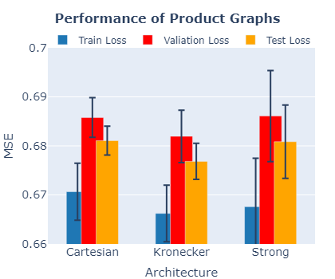

# Введение

Традиционно прогнозирование погоды опирается на системы численного прогнозирования погоды (ЧПП), которые используют физические законы для моделирования атмосферных условий. Несмотря на достижения в ассимиляции данных, физике моделей и суперкомпьютинге, повышающие точность прогнозов, высокая вычислительная стоимость ЧПП остаётся ограничивающим фактором. GraphCast — современный метод машинного обучения для среднесрочного глобального прогноза погоды с высоким разрешением.  

Наше исследование направлено на решение следующих вопросов:

1. Как внедрение механизма внимания влияет на точность и устойчивость прогнозов погоды с использованием графовых нейронных сетей (GNN)?  
2. Каков эффект обработки временной структуры данных о погоде с помощью произведённых графов?  
3. Как можно масштабировать механизм внимания для эффективной обработки более крупных графов?  

# Набор данных

Мы используем архив ERA5 — пятое поколение ECMWF-реанализа глобальных погодных и климатических условий, который ассимилирует метеорологические измерения по всему миру, начиная с 1940 года. Для экспериментов взят поднабор из WeatherBench:  

- Пространственное разрешение 1° (~128×64 узлов).  
- Шаг по времени — каждые 6 часов.  
- Нижние 5 уровней атмосферного давления (1000, 850, 700, 500 и 300 гПа).  
- Период наблюдений 2005–2010 годов.  
- 33 признака без пропусков.  

Данные разделены по датам: обучение (2005–2008), валидация (2009), тест (2010). Все признаки нормированы.

# Методы

Наш подход учитывает пространственно-временную структуру метеоданных, где каждая вершина графа соответствует географической точке с временным рядом метеоусловий. Цель — регрессия на уровне вершины: по предыдущим $O+1$ окнам наблюдений $[X_{t-O}, \dots, X_t]$ предсказать состояние $\hat X_{t+1}\in\mathbb R^F$, где $F$ — число признаков на вершину.

## Формулировка графа и архитектура модели

Аналогично GraphCast, мы работаем на двух уровнях:

- **Сеточный граф** ($G$) — прямоугольная пространственная сетка.  
- **Mesh-граф** ($M$) — треугольная сетка равномерной плотности, агрегирующая информацию от нескольких узлов $G$.  

Модель использует три графа:  
1. **$G_{G2M}$** (сетка→mesh) — рёбра $E_{G2M}$ соединяют узлы сетки и mesh-узлы по ε-окрестности (ε — нормированная длина максимального ребра mesh).  
2. **$G_M$** — собственно mesh-граф.  
3. **$G_{M2G}$** (mesh→сетка) — обратные рёбра.  

Архитектура **encode–process–decode**:  
- **Encode**: агрегирует признаки сетки за $O$ окон в mesh-узлы через $G_{G2M}$.  
- **Process**: передача сообщений по $G_M$ для захвата региональных зависимостей.  
- **Decode**: проецирует обработанные mesh-узлы обратно в сетку через $G_{M2G}$, предсказывая $t+1$.  

Для оценки внимания и произведённых графов определены четыре базовых подхода:

| Модель                 | Архитектура                                                                                                                                                                            |
| ---------------------- | --------------------------------------------------------------------------------------------------------------------------------------------------------------------------------------- |
| **Базовая**            | Encode: MLP [48,48,64] + GCNConv [64,64,64]; Process: GCNConv [64,64,64]; Decode: MLP [64,64,64] + GCNConv [48,48,33]                                                                     |
| **Внимание**           | Encode: MLP [48,48,64] + GCNConv [64,64,64]; Process: **GATConv** [64,64,64]; Decode: MLP [64,64,64] + GCNConv [48,48,33]                                                                |
| **Произведённый граф** | Proj-graph: GCNConv (скрытое 33, слоёв 5); затем Encode: MLP [48,48,64] + GCNConv [64,64,64]; Process: GCNConv [64,64,64]; Decode: MLP [64,64,64] + GCNConv [48,48,33]                    |
| **Разреженное внимание** | Encode: MLP [48,48,64] + GCNConv [64,64,64]; Process: **SparseGATConv** [64,64,64]; Decode: MLP [64,64,64] + GCNConv [48,48,33]                                                         |

## Механизм внимания

Существующие работы не исследовали внимание, как в GAT. Мы применяем **GATConv** для оценки важности соседей $N_i$ узла $v_i$, ожидая улучшения качества прогноза. Например, при ветре $(u=10, v=0)$ рёбра север–юг могут получать меньшие веса, чем запад–восток. В мульти-mesh варианте внимание также позволит учитывать важность локальных и глобальных связей в $E_M$.

## Произведённые графы

В GraphCast авторы конкатенируют признаки по временным шагам, формируя вектор признаков mesh-узла. Мы исследуем альтернативу — построение произведённого графа, где число временных слоёв $O$ соответствует порядку графового произведения. Несколько слоёв **GCNConv** последовательно передают информацию от ранних временных состояний к последнему, захватывая временную зависимость.

## SparseGAT

Мы вводим **SparseGAT** — механизм жёсткого отсечения рёбер на основе внимания. SparseGAT сохраняет только наиболее значимые рёбра, повышая масштабируемость и интерпретируемость. Многоголовое внимание позволяет анализировать вклад каждого признака и узла, а жёсткая маска ускоряет обучение на больших графах.

# Результаты

## Настройка экспериментов

Все эксперименты сравнивались с базовой моделью из раздела выше. Подбор гиперпараметров был минимальным:

- **Функция потерь**: MSE (среднеквадратичная ошибка).  
- **Оптимизатор**: Adam с ранней остановкой (Early Stopping).  

| Параметр                   | Значение             |
| -------------------------- | -------------------- |
| Размер батча               | 1                    |
| Скорость обучения          | 1×10⁻³               |
| Уровни mesh                | 3 и 5                |
| ε                          | 0.5                  |
| Окно наблюдений (O)        | 2                    |
| Δ для Early Stopping       | 1×10⁻⁴               |
| Patience                   | 10                   |

### RQ1: Влияние механизма внимания


График демонстрирует, что внимание улучшает устойчивость и снижает разброс результатов по сравнению с GCN, не ухудшая при этом качество на тестовых данных.

| Модель | 1 голова       | 4 головы        | 8 голов         | 33 головы      |
| ------ | -------------- | --------------- | --------------- | -------------- |
| GAT    | 0.0861 ± 0.0004 | 0.0883 ± 0.0004 | 0.0907 ± 0.0006 | 0.0861 ± 0.0004 |

### RQ2: Интеграция произведённых графов



Использование произведённых графов вместо временной конкатенации ухудшает качество, вероятно из-за потери части информации при передаче сообщений только на текущем шаге.

### RQ3: Разреженное внимание для масштабируемости

|                | **MSE**         | **Время обучения (мин)**                 | **Число рёбер**                               |
| -------------- | --------------- | ---------------------------------------- | ---------------------------------------------- |
| **SparseGAT**  | 0.0963 ± 0.0005 | 39.3 (Patience=10), 263.0 (Patience=100) | 36 345 (Patience=10), 24 151 (Patience=100)    |
| **GAT**        | 0.0918 ± 0.0020 | 41.5 (Patience=10), 491.5 (Patience=100) | 75 522 (в обоих случаях)                      |

# Структура кода

```bash
├── src/
│   └── mesh/
│       ├── create_mesh.py              # Функции для создания и обработки mesh.
│       ├── grid_mesh_connectivity.py   # Утилиты для формирования связей сетка→mesh.
│   └── data/
│       ├── data_configs.py             # Конфигурации для каждого набора данных.
│       ├── dataloaders.py              # Загрузчики данных для обучения моделей.
│   ├── config.py                       # Конфигурация эксперимента.
│   ├── constants.py                    # Константы проекта.
│   ├── create_graphs.py                # Утилиты для построения графов кодировщика, процессора и декодера.
│   ├── main.py                         # Главный скрипт для запуска обучения.
│   ├── models.py                       # Определения всех моделей на PyTorch.
│   ├── train.py                        # Логика обучения и тестирования моделей.
│   ├── utils.py                        # Вспомогательные скрипты проекта и из GraphCast.
│   ├── visualization_utils.py          # Скрипты для визуализации mesh.
│
├── experiments/                        # Конфигурации всех экспериментов.
│   ├── baseline/                       # Эксперимент базовой модели.
│   ├── attention/                      # Эксперимент с механизмом внимания.
│   ├── product_graph/                  # Эксперимент с произведёнными графами.
│   ├── sparse_attention/               # Эксперимент с разреженным вниманием.
│
├── requirements.txt                    # Зависимости проекта.
└── README.md                           # Текущий обзор проекта.
