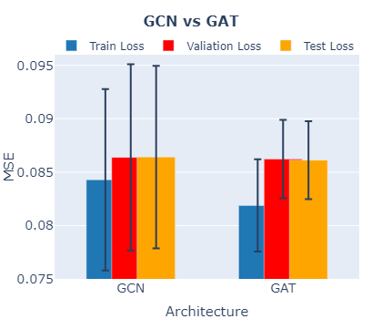
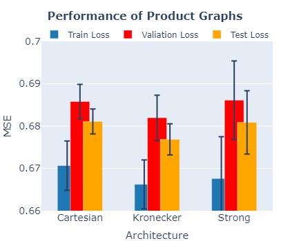

# Введение

Традиционно прогнозирование погоды опирается на системы численного прогнозирования погоды (ЧПП), которые используют физические законы для моделирования атмосферных условий. Несмотря на достижения в ассимиляции данных, физике моделей и суперкомпьютинге, повышающие точность прогнозов, высокая вычислительная стоимость ЧПП остаётся ограничивающим фактором. GraphCast — современный метод машинного обучения для среднесрочного глобального прогноза погоды с высоким разрешением.  

Наше исследование направлено на решение следующих вопросов:

1. Как внедрение механизма внимания влияет на точность и устойчивость прогнозов погоды с использованием графовых нейронных сетей (GNN)?  
2. Каков эффект обработки временной структуры данных о погоде с помощью произведённых графов?  
3. Как можно масштабировать механизм внимания для эффективной обработки более крупных графов?  

# Набор данных

Мы используем архив ERA5 — пятое поколение ECMWF-реанализа глобальных погодных и климатических условий, который ассимилирует метеорологические измерения по всему миру, начиная с 1940 года. Для экспериментов взят поднабор из WeatherBench:  

- Пространственное разрешение 1° (~128×64 узлов).  
- Шаг по времени — каждые 6 часов.  
- Нижние 5 уровней атмосферного давления (1000, 850, 700, 500 и 300 гПа).  
- Период наблюдений 2005–2010 годов.  
- 33 признака без пропусков.  

Данные разделены по датам: обучение (2005–2008), валидация (2009), тест (2010). Все признаки нормированы.

# Методы

Наш подход учитывает пространственно-временную структуру метеоданных, где каждая вершина графа соответствует географической точке с временным рядом метеоусловий. Цель — регрессия на уровне вершины: по предыдущим $O+1$ окнам наблюдений $[X_{t-O}, \dots, X_t]$ предсказать состояние $\hat X_{t+1}\in\mathbb R^F$, где $F$ — число признаков на вершину.

## Формулировка графа и архитектура модели

Аналогично GraphCast, мы работаем на двух уровнях:

- **Сеточный граф** ($G$) — прямоугольная пространственная сетка.  
- **Mesh-граф** ($M$) — треугольная сетка равномерной плотности, агрегирующая информацию от нескольких узлов $G$.  

Модель использует три графа:  
1. **$G_{G2M}$** (сетка→mesh) — рёбра $E_{G2M}$ соединяют узлы сетки и mesh-узлы по ε-окрестности (ε — нормированная длина максимального ребра mesh).  
2. **$G_M$** — собственно mesh-граф.  
3. **$G_{M2G}$** (mesh→сетка) — обратные рёбра.  

Архитектура **encode–process–decode**:  
- **Encode**: агрегирует признаки сетки за $O$ окон в mesh-узлы через $G_{G2M}$.  
- **Process**: передача сообщений по $G_M$ для захвата региональных зависимостей.  
- **Decode**: проецирует обработанные mesh-узлы обратно в сетку через $G_{M2G}$, предсказывая $t+1$.  

Для оценки внимания и произведённых графов определены четыре базовых подхода:

| Модель                 | Архитектура                                                                                                                                                                            |
| ---------------------- | --------------------------------------------------------------------------------------------------------------------------------------------------------------------------------------- |
| **Базовая**            | Encode: MLP [48,48,64] + GCNConv [64,64,64]; Process: GCNConv [64,64,64]; Decode: MLP [64,64,64] + GCNConv [48,48,33]                                                                     |
| **Внимание**           | Encode: MLP [48,48,64] + GCNConv [64,64,64]; Process: **GATConv** [64,64,64]; Decode: MLP [64,64,64] + GCNConv [48,48,33]                                                                |
| **Произведённый граф** | Proj-graph: GCNConv (скрытое 33, слоёв 5); затем Encode: MLP [48,48,64] + GCNConv [64,64,64]; Process: GCNConv [64,64,64]; Decode: MLP [64,64,64] + GCNConv [48,48,33]                    |
| **Разреженное внимание** | Encode: MLP [48,48,64] + GCNConv [64,64,64]; Process: **SparseGATConv** [64,64,64]; Decode: MLP [64,64,64] + GCNConv [48,48,33]                                                         |

## Механизм внимания

Существующие работы не исследовали внимание, как в GAT. Мы применяем **GATConv** для оценки важности соседей $N_i$ узла $v_i$, ожидая улучшения качества прогноза. Например, при ветре $(u=10, v=0)$ рёбра север–юг могут получать меньшие веса, чем запад–восток. В мульти-mesh варианте внимание также позволит учитывать важность локальных и глобальных связей в $E_M$.

## Произведённые графы

В GraphCast авторы конкатенируют признаки по временным шагам, формируя вектор признаков mesh-узла. Мы исследуем альтернативу — построение произведённого графа, где число временных слоёв $O$ соответствует порядку графового произведения. Несколько слоёв **GCNConv** последовательно передают информацию от ранних временных состояний к последнему, захватывая временную зависимость.

## SparseGAT

Мы вводим **SparseGAT** — механизм жёсткого отсечения рёбер на основе внимания. SparseGAT сохраняет только наиболее значимые рёбра, повышая масштабируемость и интерпретируемость. Многоголовое внимание позволяет анализировать вклад каждого признака и узла, а жёсткая маска ускоряет обучение на больших графах.

# Результаты

## Настройка экспериментов

Все эксперименты сравнивались с базовой моделью из раздела выше. Подбор гиперпараметров был минимальным:

- **Функция потерь**: MSE (среднеквадратичная ошибка).  
- **Оптимизатор**: Adam с ранней остановкой (Early Stopping).  

| Параметр                   | Значение             |
| -------------------------- | -------------------- |
| Размер батча               | 1                    |
| Скорость обучения          | 1×10⁻³               |
| Уровни mesh                | 3 и 5                |
| ε                          | 0.5                  |
| Окно наблюдений (O)        | 2                    |
| Δ для Early Stopping       | 1×10⁻⁴               |
| Patience                   | 10                   |

### RQ1: Влияние механизма внимания



График демонстрирует, что внимание улучшает устойчивость и снижает разброс результатов по сравнению с GCN, не ухудшая при этом качество на тестовых данных.

| Модель | 1 голова       | 4 головы        | 8 голов         | 33 головы      |
| ------ | -------------- | --------------- | --------------- | -------------- |
| GAT    | 0.0861 ± 0.0004 | 0.0883 ± 0.0004 | 0.0907 ± 0.0006 | 0.0861 ± 0.0004 |

### RQ2: Интеграция произведённых графов



Использование произведённых графов вместо временной конкатенации ухудшает качество, вероятно из-за потери части информации при передаче сообщений только на текущем шаге.

### RQ3: Разреженное внимание для масштабируемости

|                | **MSE**         | **Время обучения (мин)**                 | **Число рёбер**                               |
| -------------- | --------------- | ---------------------------------------- | ---------------------------------------------- |
| **SparseGAT**  | 0.0963 ± 0.0005 | 39.3 (Patience=10), 263.0 (Patience=100) | 36 345 (Patience=10), 24 151 (Patience=100)    |
| **GAT**        | 0.0918 ± 0.0020 | 41.5 (Patience=10), 491.5 (Patience=100) | 75 522 (в обоих случаях)                      |

# Структура кода

```bash
├── src/
│   └── mesh/
│       ├── create_mesh.py              # Функции для создания и обработки mesh.
│       ├── grid_mesh_connectivity.py   # Утилиты для формирования связей сетка→mesh.
│   └── data/
│       ├── data_configs.py             # Конфигурации для каждого набора данных.
│       ├── dataloaders.py              # Загрузчики данных для обучения моделей.
│       ├── dataloader_chunked.py       # Загрузчик для больших сеток (512×256+): memmap + sliding window.
│   └── assimilation/
│       ├── nudging.py                  # Nudging-ассимиляция для инференса.
│       ├── optimal_interpolation.py    # Оптимальная интерполяция.
│   ├── config.py                       # Конфигурация эксперимента.
│   ├── constants.py                    # Константы проекта.
│   ├── create_graphs.py                # Утилиты для построения графов кодировщика, процессора и декодера.
│   ├── main.py                         # Главный скрипт для запуска обучения.
│   ├── models.py                       # Определения всех моделей на PyTorch.
│   ├── train.py                        # Логика обучения и тестирования моделей.
│   ├── utils.py                        # Вспомогательные скрипты проекта и из GraphCast.
│   ├── visualization_utils.py          # Скрипты для визуализации mesh.
│
├── scripts/
│   ├── build_dataset_512x256.py        # Скачивание 512×256 датасета из WeatherBench2.
│   ├── build_dataset_wb2.py            # Скачивание 64×32 датасета из WeatherBench2.
│   ├── predict.py                      # Инференс (прогноз) обученной модели.
│   ├── build_region_wb2.py             # Сборка регионального датасета.
│
├── experiments/                        # Конфигурации всех экспериментов.
│   ├── baseline/                       # Эксперимент базовой модели.
│   ├── attention/                      # Эксперимент с механизмом внимания.
│   ├── product_graph/                  # Эксперимент с произведёнными графами.
│   ├── sparse_attention/               # Эксперимент с разреженным вниманием.
│   ├── wb2_512x256_19f_ar/             # 512×256 с 19 переменными и AR-обучением (v1: GCNConv, 128d, ~210K params).
│   ├── wb2_512x256_19f_ar_v2/          # v2: InteractionNet, 256d, 12 msg steps, ~5.9M params.
│
├── data/datasets/                      # Наборы данных.
│   ├── wb2_512x256_19f_ar/             # 512×256, 19 фич, float16 memmap (~81 GB).
│
├── requirements.txt                    # Зависимости проекта.
└── README.md                           # Текущий обзор проекта.
```

---

# Датасет 512×256 (высокое разрешение)

## Описание

Датасет ERA5 на сетке 512×256 (~0.7°) для обучения модели с минимальными артефактами при инференсе на региональных сетках высокого разрешения. 19 каналов (переменных):

| # | Канал | Описание |
|---|-------|----------|
| 1 | t2m | Температура воздуха на высоте 2 м |
| 2 | 10u | U-компонента ветра на 10 м |
| 3 | 10v | V-компонента ветра на 10 м |
| 4 | msl | Давление на уровне моря |
| 5 | tp | Осадки (6-часовые) |
| 6 | sp | Приземное давление |
| 7 | tcwv | Общее содержание водяного пара |
| 8 | z_surf | Геопотенциал поверхности (орография) |
| 9 | lsm | Маска суша/море |
| 10–14 | t/u/v/z/q@850 | Температура, ветер, геопотенциал, влажность на 850 гПа |
| 15–19 | t/u/v/z/q@500 | То же на 500 гПа |

- **Период**: 2010–2021 (12 лет, ~17 500 таймстепов × 6ч)
- **Хранение**: float16 memmap (`data.npy`, ~81 GB)
- **Статистика**: `scalers.npz` (mean/std для нормализации)

## Скачивание

```bash
# Активация окружения
source .venv/bin/activate

# Полная загрузка (~2–3 часа при 70–90 Мбит/с)
python scripts/build_dataset_512x256.py

# С другим периодом
python scripts/build_dataset_512x256.py --start-year 2010 --end-year 2022

# Продолжить после прерывания (Ctrl+C / перезагрузка / смена VPN)
python scripts/build_dataset_512x256.py --resume
```

### Пауза и продолжение

Загрузку можно прервать в любой момент через `Ctrl+C`. Файл `data.npy` — это memory-mapped массив,
уже записанные таймстепы сохраняются на диске. Чтобы продолжить:

```bash
python scripts/build_dataset_512x256.py --resume
```

Скрипт автоматически определит, сколько таймстепов уже записано, пересчитает статистику по ним (из memmap, без повторной скачки), и продолжит загрузку с того места, где остановился. Можно свободно включать/выключать VPN между запусками.

## Обучение

```bash
# На локальной машине / сервере с GPU
python -m src.main experiments/wb2_512x256_19f_ar

# С wandb логированием (поставить "wandb_log": true в config.json)
python -m src.main experiments/wb2_512x256_19f_ar
```

Конфигурация в `experiments/wb2_512x256_19f_ar/config.json`:
- **batch_size**: 1 (512×256 × 19 фич — один сэмпл занимает ~2 GB в float32)
- **max_ar_steps**: 4 (curriculum: 1→2→3→4 шага авторегрессии по эпохам)
- **obs_window**: 2, **pred_window**: 1 (как в оригинальном GraphCast)
- **mesh_levels**: [4, 6], **grid2mesh_radius**: 0.6

Обученная модель сохраняется в `experiments/wb2_512x256_19f_ar/best_model.pth`.

## Обучение v2 (InteractionNet)

Улучшенная архитектура, приближенная к оригинальному GraphCast:

```bash
python -m src.main experiments/wb2_512x256_19f_ar_v2
```

Ключевые отличия v2 от v1:

| Аспект | v1 | v2 |
|--------|-----|-----|
| Processor GNN | GCNConv (4 слоя, только узлы) | **InteractionNet** (12 шагов, узлы + рёбра) |
| Edge features | ❌ | ✅ 4D: distance + 3D relative position |
| Residual connections | ❌ | ✅ Node + Edge на каждом шаге |
| Latent dimension | 128 | **256** |
| Activation | PReLU | **Swish** (SiLU) |
| Параметры | ~210K | **~5.9M** (28×) |
| LR / Epochs | 5e-4 / 60 | 3e-4 / 80 |

Почему параметры выросли в 28 раз:
- **Latent 128→256**: каждая весовая матрица 4× больше (256² vs 128²)
- **12 шагов вместо 5 слоёв**: 2.4× больше
- **InteractionNet vs GCNConv**: на каждом шаге 2 MLP (edge + node) вместо 1 матрицы — ~6× на шаг
- Итого: 4 × 2.4 × 6 ≈ 28×

Для сравнения: Google GraphCast = 36.7M параметров (ещё 6× больше v2).

Конфигурация в `experiments/wb2_512x256_19f_ar_v2/config.json`.
Подробное сравнение в `experiments/wb2_512x256_19f_ar_v2/CHANGELOG_v1_vs_v2.md`.

Ожидаемое время обучения на A100: ~10–14 дней.

Лог обучения (можно следить даже после отключения от сессии):
```bash
tail -f experiments/wb2_512x256_19f_ar_v2/training_log.txt
```

## Инференс (прогноз)

```bash
python scripts/predict.py experiments/wb2_512x256_19f_ar \
    --data-dir data/datasets/wb2_512x256_19f_ar
```

## Перенос на кластер / S3

Датасет **не сжат** — это сырой float16 numpy memmap. Для переноса на S3:

```bash
# Сжать перед загрузкой (~81 GB → ~30-40 GB)
cd data/datasets/wb2_512x256_19f_ar
tar czf wb2_512x256_19f_ar.tar.gz data.npy scalers.npz coords.npz variables.json dataset_info.json

# Загрузить на S3
aws s3 cp wb2_512x256_19f_ar.tar.gz s3://your-bucket/datasets/

# На кластере: скачать и распаковать
aws s3 cp s3://your-bucket/datasets/wb2_512x256_19f_ar.tar.gz .
tar xzf wb2_512x256_19f_ar.tar.gz -C data/datasets/wb2_512x256_19f_ar/
```

На кластере никаких дополнительных действий с датасетом не нужно — `data.npy` читается через `np.memmap` напрямую, без загрузки в RAM целиком.
